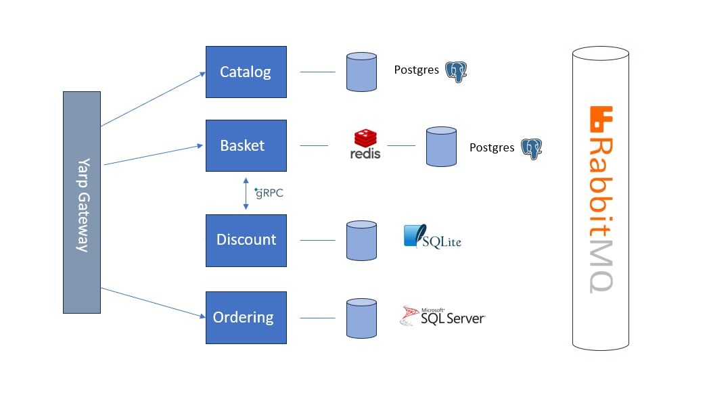

# EShop
EShop is a web application for online shopping. It offers users the ability to register, browse through product categories, select items from the catalog, apply discount calculations, create and manage a shopping cart, and complete their orders.

## Content
- [Architecture](#Architecture)
- [Technologies](#Technologies)
- [Deployment](#Deployment)
- [Why was the project created?](#Why-was-the-project-created?)

## Architecture
The project is based on a microservice architecture, with multiple services managing different aspects of the application.

### Services
- [BasketService](src/Services/Basket/Basket.API)
- [CatalogService](src/Services/Catalog/CatalogAPI)
- [GatewayService](src/ApiGateway/YarpApiGateway)
- [DiscountService](src/Services/Discount/Discount.Grpc)
- [OrderingService](src/Services/Ordering)
- [IdentityService](src/Services/Identity)

## Technologies
### Backend
- [C#.NET8](https://learn.microsoft.com/en-us/dotnet/core/whats-new/dotnet-8/overview): Main language for backend development.
- [gRPC](https://grpc.io/) and REST API: Used for data exchange between microservices.
- [RabbitMQ](https://www.rabbitmq.com/): Message queueing system for processing messages between services.
- [Entity Framework Core](https://learn.microsoft.com/en-us/ef/core/): ORM for database management.
- [PostgreSQL](https://www.postgresql.org/) and [MongoDB](https://www.mongodb.com/): Main databases.
- [YARP Gateway](https://microsoft.github.io/reverse-proxy/): Proxy server for request routing.
- [Docker](https://www.docker.com/): Application containerization.
- [MediatR](https://github.com/jbogard/MediatR): library that implements the Mediator pattern.
- [FluentValidation](https://fluentvalidation.net/): is a popular library for building strongly-typed validation rules.
- [Redis](https://redis.io/meeting/?gad_source=1&utm_content=redis_exact): is an in-memory data structure store used as a cache to enhance application performance.
- [SQLite](https://www.sqlite.org/): is a lightweight, serverless, self-contained SQL database engine.
 

## Deployment
[Docker](src/docker-compose.yml)  
Docker and containers are used for building and deployment, allowing the application to be easily transferred and scaled in the cloud or locally.

## Why was the project created?
The EShop project was created as an educational initiative to explore and implement a range of modern technologies and architectural patterns. It provides a practical learning environment for understanding microservice architecture, integrating diverse technologies, and applying best practices in software development. 

